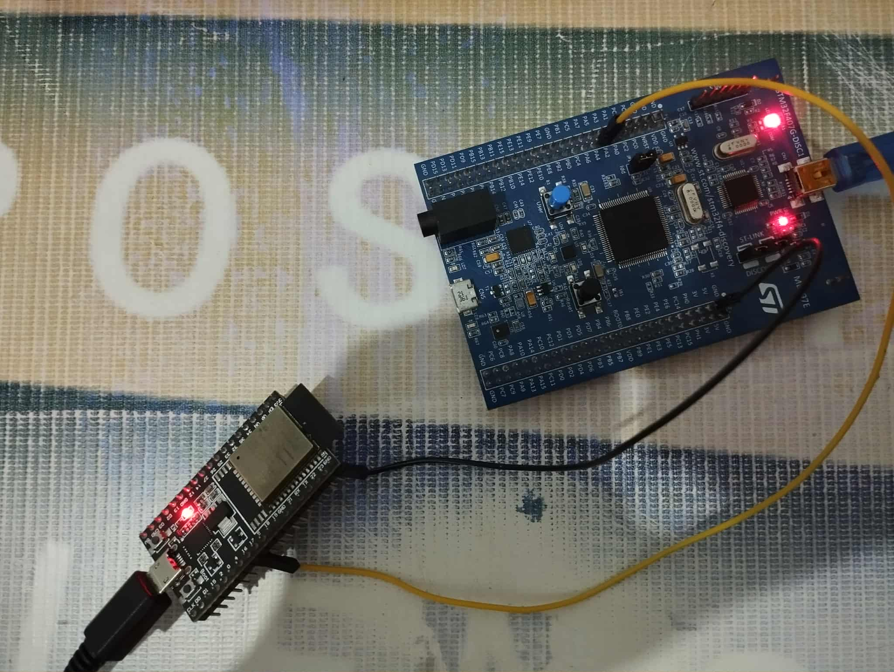
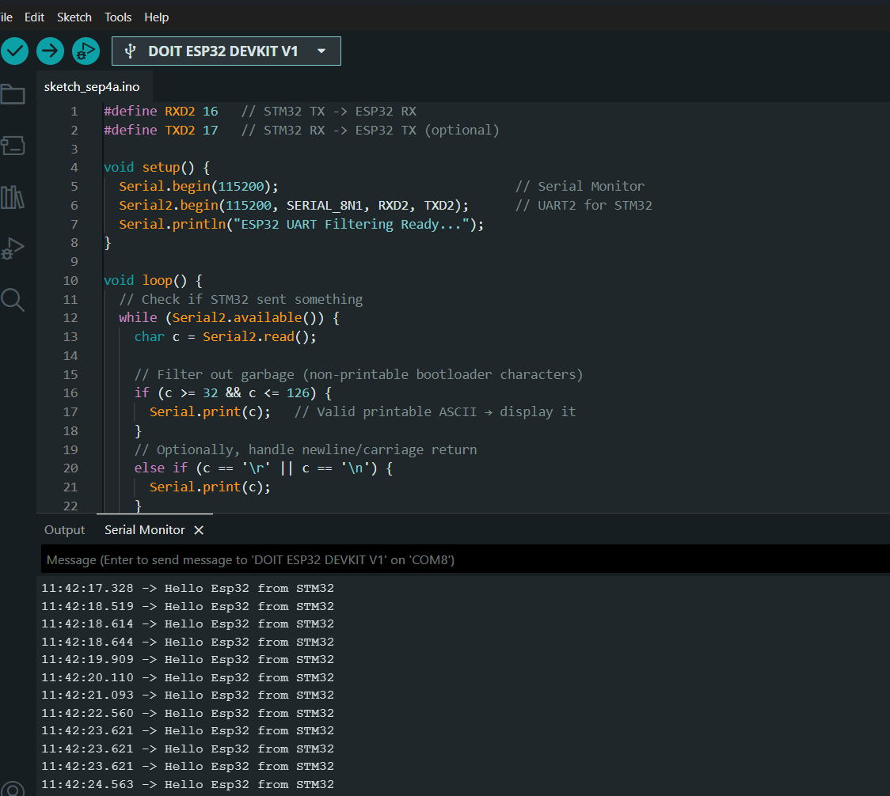

# STM32F407 DMA UART Transfer Project

A bare-metal implementation of Direct Memory Access (DMA) on STM32F407 microcontroller, demonstrating memory-to-peripheral (M2P) data transfer from SRAM to UART TX, with data monitoring via ESP32 serial interface.

## 🎯 Project Overview

This project implements a button-triggered DMA transfer system that sends data from memory to UART2 peripheral without CPU intervention. The transmitted data can be monitored using an ESP32 development board connected to the UART output.

## 🔧 Hardware Requirements

- **STM32F407 Discovery Board** (or compatible STM32F407 microcontroller)
- **ESP32 Development Board** (for serial monitoring)
- **User Button** (onboard blue button on STM32F407 Discovery)
- **Jumper Wires** for connections

## 🔌 Circuit Description

The circuit consists of a simple UART communication between STM32F407 Discovery board and ESP32:

- **STM32F407 Discovery Board**: Acts as the transmitter using DMA to send data
- **ESP32 Development Board**: Acts as the receiver and serial monitor
- **Connection**: Single wire connection from STM32 UART TX to ESP32 UART RX
- **Trigger**: Onboard USER button (blue button) on STM32F407 Discovery board

### Hardware Connections

```
STM32F407 Discovery     ESP32
------------------      -----
PA2 (UART2_TX)     --> GPIO16 (RX2) or any RX pin
PA3 (UART2_RX)     --> Not used in this project
GND                --> GND

STM32F407 Discovery Onboard Components:
USER Button (Blue) --> PA0 (already connected onboard)
```

### Circuit Image

*STM32F407 Discovery board connected to ESP32 via UART*

## ⚙️ System Configuration

### Clock Configuration
- **System Clock**: 16 MHz (default HSI)
- **UART2 Baud Rate**: 115200 (configured via BRR = 0x8B)

### DMA Configuration
- **Controller**: DMA1
- **Stream**: Stream 6
- **Channel**: Channel 4 (UART2_TX)
- **Direction**: Memory-to-Peripheral (M2P)
- **Mode**: FIFO mode with full threshold
- **Transfer Width**: 8-bit (byte)
- **Memory Increment**: Enabled

### GPIO Configuration
- **PA0**: Input with EXTI interrupt (onboard USER button)
- **PA2**: UART2_TX (Alternate Function 7)
- **PA3**: UART2_RX (Alternate Function 7, configured but not used)

## 🚀 How It Works

1. **Initialization Phase**:
   - Button (PA0) configured with external interrupt on falling edge
   - UART2 initialized with 115200 baud rate
   - DMA1 Stream 6 configured for UART2_TX transfer
   - DMA interrupts enabled for transfer monitoring

2. **Transfer Trigger**:
   - Press the blue USER button on STM32F407 Discovery board
   - EXTI0 interrupt handler enables UART2 DMA request
   - DMA automatically transfers data from memory to UART2_DR

3. **Data Transfer**:
   - Message: `"Hello Esp32 from STM32 \r\n"`
   - DMA handles transfer without CPU intervention
   - Transfer complete interrupt re-enables the system for next transfer

4. **Monitoring**:
   - ESP32 receives data via UART and displays on serial monitor

## 📁 Project Structure

```
STM32_DMA_Project/
├── main.c                    # Main application code
├── stm32f4xx_it.c           # Interrupt handlers
├── stm32f407xx.h            # STM32F407 register definitions
├── images/
│   ├── circuit_setup.png    # Hardware setup photo
│   └── serial_output.png    # Serial monitor results
└── README.md                # This file
```

## 🔍 Key Features

### DMA Implementation
- **Zero CPU Overhead**: Data transfer occurs without CPU intervention
- **Interrupt-Driven**: Complete transfer monitoring via DMA interrupts
- **Error Handling**: Comprehensive error detection and handling
- **Automatic Restart**: System automatically prepares for next transfer

### Interrupt Handling
- **EXTI0**: Button press detection and DMA trigger
- **DMA1_Stream6**: Transfer completion and error monitoring
- **Callback Functions**: Modular interrupt response system

### Safety Features
- Transfer error detection (TE, FE, DME)
- Proper interrupt flag clearing
- Button debouncing through hardware pull-up

## 🛠️ Code Highlights

### Button Initialization with EXTI (Onboard USER Button)
```c
void button_init(void)
{
    // Enable GPIOA clock
    pRCC->AHB1ENR = (1 << 0);
    
    // Configure PA0 as input (USER button is connected to PA0)
    pGPIOA->MODER &= ~(0x3 << 0);
    
    // Enable external interrupt on PA0
    pEXTI->IMR |= (1 << 0);
    
    // Configure SYSCFG for PA0 -> EXTI0 mapping
    pRCC->APB2ENR |= (1 << 14);  // SYSCFG clock
    pSYSCFG->EXTICR[0] &= ~(0xF << 0);
    pSYSCFG->EXTICR[0] |= (0x0 << 0);  // PA0 -> EXTI0
    
    // Falling edge trigger (USER button pulls to ground when pressed)
    pEXTI->FTSR |= (1 << 0);
    
    // Enable NVIC interrupt
    NVIC_EnableIRQ(EXTI0_IRQn);
}
```

### UART2 Peripheral Configuration
```c
void uart2_init(void)
{
    // Enable UART2 peripheral clock
    pRCC->APB1ENR |= (1 << 17);
    
    // Configure PA2 as UART2_TX (Alternate Function 7)
    pGPIOA->MODER &= ~(0x3 << 4);
    pGPIOA->MODER |= (0x2 << 4);    // AF mode
    pGPIOA->AFR[0] &= ~(0xF << (2*4));
    pGPIOA->AFR[0] |= (0x7 << (2*4));  // AF7 for UART2
    
    // Configure PA3 as UART2_RX (Alternate Function 7)
    pGPIOA->MODER &= ~(0x3 << 6);
    pGPIOA->MODER |= (0x2 << 6);    // AF mode
    pGPIOA->AFR[0] &= ~(0xF << (3*4));
    pGPIOA->AFR[0] |= (0x7 << (3*4));  // AF7 for UART2
    
    // Set baud rate to 115200 (16MHz/115200 ≈ 139 = 0x8B)
    pUART2->BRR = 0x8B;
    
    // Enable transmitter and UART
    pUART2->CR1 |= (1 << 3);   // TE bit
    pUART2->CR1 |= (1 << 13);  // UE bit
}
```

### DMA Stream Configuration
```c
void dma1_init(void)
{
    // Enable DMA1 peripheral clock
    pRCC->AHB1ENR |= (1 << 21);
    
    // Configure Channel 4 for UART2_TX on Stream 6
    pSTREAM6->CR &= ~(0x7 << 25);   // Clear channel bits
    pSTREAM6->CR |= (0x4 << 25);    // Set channel 4
    
    // Set memory source address
    pSTREAM6->M0AR = (uint32_t) data_stream;
    
    // Set peripheral destination address (UART2 Data Register)
    pSTREAM6->PAR = (uint32_t) &pUART2->DR;
    
    // Set number of data items to transfer
    pSTREAM6->NDTR = sizeof(data_stream);
    
    // Configure transfer direction (Memory to Peripheral)
    pSTREAM6->CR |= (0x1 << 6);     // DIR[1:0] = 01
    
    // Configure data width (8-bit for both memory and peripheral)
    pSTREAM6->CR &= ~(0x3 << 13);   // MSIZE = 00 (8-bit)
    pSTREAM6->CR &= ~(0x3 << 11);   // PSIZE = 00 (8-bit)
    
    // Enable memory address increment
    pSTREAM6->CR |= (1 << 10);      // MINC = 1
    
    // Configure FIFO mode
    pSTREAM6->FCR |= (1 << 2);      // DMDIS = 1 (FIFO mode)
    pSTREAM6->FCR &= ~(0x3 << 0);   // Clear FTH
    pSTREAM6->FCR |= (0x3 << 0);    // FTH = 11 (full FIFO)
}
```

### DMA Interrupt Configuration
```c
void DMA1_Interrupt_Configuration(void)
{
    // Enable Half Transfer Complete Interrupt
    pSTREAM6->CR |= (1 << 3);   // HTIE
    
    // Enable Transfer Complete Interrupt  
    pSTREAM6->CR |= (1 << 4);   // TCIE
    
    // Enable Transfer Error Interrupt
    pSTREAM6->CR |= (1 << 2);   // TEIE
    
    // Enable FIFO Error Interrupt
    pSTREAM6->FCR |= (1 << 7);  // FEIE
    
    // Enable Direct Mode Error Interrupt
    pSTREAM6->CR |= (1 << 1);   // DMEIE
    
    // Enable DMA1 Stream 6 interrupt in NVIC
    NVIC_EnableIRQ(DMA1_Stream6_IRQn);
}
```

### Button Interrupt Handler (Transfer Trigger)
```c
void EXTI0_IRQHandler(void)
{
    USART_TypeDef *pUART2 = USART2;
    
    // Enable UART2 DMA transmit request
    pUART2->CR3 |= (1 << 7);    // DMAT bit
    
    // Clear EXTI pending bit
    clear_EXTI_Pending_bit();
}
```

### DMA Interrupt Handler with Status Checking
```c
// Status check macros for DMA1 Stream 6 (bits 16-21 in HISR)
#define is_it_HT()  DMA1->HISR & (1 << 20)  // Half Transfer
#define is_it_FT()  DMA1->HISR & (1 << 21)  // Full Transfer  
#define is_it_TE()  DMA1->HISR & (1 << 19)  // Transfer Error
#define is_it_FE()  DMA1->HISR & (1 << 16)  // FIFO Error
#define is_it_DME() DMA1->HISR & (1 << 18)  // Direct Mode Error

void DMA1_Stream6_IRQHandler(void)
{
    if(is_it_HT()) {
        DMA1->HIFCR |= (1 << 20);       // Clear HT flag
        HT_Complete_callback();
    }
    else if(is_it_FT()) {
        DMA1->HIFCR |= (1 << 21);       // Clear TC flag  
        FT_Complete_callback();
    }
    else if(is_it_TE()) {
        DMA1->HIFCR |= (1 << 19);       // Clear TE flag
        TE_error_callback();
    }
    else if(is_it_FE()) {
        DMA1->HIFCR |= (1 << 16);       // Clear FE flag
        FE_error_callback(); 
    }
    else if(is_it_DME()) {
        DMA1->HIFCR |= (1 << 18);       // Clear DME flag
        DME_error_callback();
    }
}
```

### Transfer Complete Callback (Auto-Restart)
```c
void FT_Complete_callback(void)
{
    USART_TypeDef *pUART2 = USART2;
    DMA_Stream_TypeDef *pSTREAM6 = DMA1_Stream6;
    
    // Reload transfer count for next transmission
    uint32_t len = sizeof(data_stream);
    pSTREAM6->NDTR = len;
    
    // Disable UART DMA request temporarily
    pUART2->CR3 &= ~(1 << 7);
    
    // Re-enable DMA stream for next button press
    Enable_DMA1_Stream6();
}
```

### Memory Data Buffer
```c
char data_stream[] = "Hello Esp32 from STM32 \r\n";
```

## 📊 Results

### Output Results

*ESP32 serial monitor showing DMA transfer results - "Hello Esp32 from STM32" messages*

## 📊 Performance Characteristics

- **Transfer Speed**: Limited by UART baud rate (115200 bps)
- **CPU Usage**: Near zero during transfer
- **Memory Usage**: ~27 bytes for message string
- **Response Time**: Immediate on button press

## 🐛 Troubleshooting

### Common Issues:

1. **No Data Received on ESP32**:
   - Check UART connections (TX-RX crossover)
   - Verify baud rate match (115200)
   - Ensure common ground connection

2. **Button Not Triggering**:
   - Verify onboard USER button is functioning
   - Check if EXTI0 interrupt is properly enabled
   - Test with oscilloscope on PA0 pin

3. **DMA Not Working**:
   - Confirm DMA clock is enabled
   - Verify channel/stream mapping
   - Check UART DMA enable bit

## 🔮 Future Enhancements

- [ ] Add circular DMA mode for continuous transmission
- [ ] Implement bidirectional communication
- [ ] Add multiple message buffers
- [ ] Integrate with FreeRTOS
- [ ] Add SPI/I2C DMA examples
- [ ] Implement DMA memory-to-memory transfers

## 📚 Learning Outcomes

This project demonstrates:
- **Bare-metal STM32 programming**
- **DMA controller configuration**
- **Interrupt handling and callbacks**
- **UART peripheral setup**
- **GPIO and EXTI configuration**
- **STM32-ESP32 communication**

## 📄 License

This project is provided as-is for educational purposes. Feel free to modify and distribute according to your needs.

